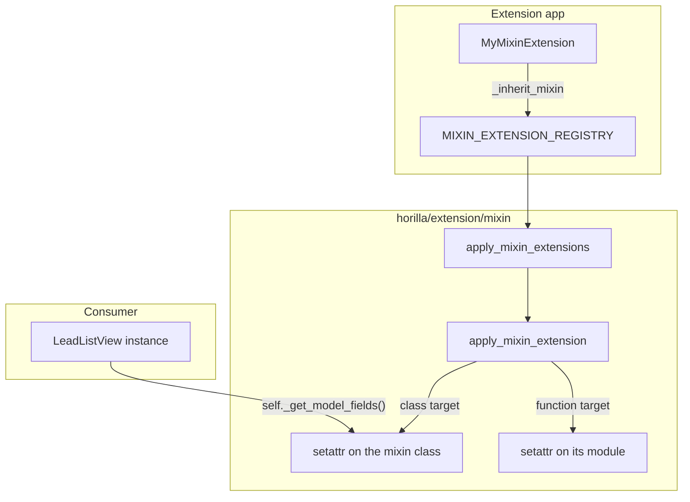

# Horilla `_inherit_mixin` — Mixin/Function Extension Guide

> **Status:** Implemented (`horilla/extension/mixin/`)
> **Related:** [Extension system index](../inherit.md) · [View `_inherit_view`](../view/inherit.md) · [Model `_inherit_model`](../models/inherit.md)

Extend a bare mixin class (mixed into consumers only through ordinary Python inheritance, never itself instantiated or dispatched) or a bare module-level function — the one case every other `_inherit_*` mechanism cannot reach, because none of them have a per-request resolution point to hook into.

---

## Table of contents

1. [Problem](#problem)
2. [Why the other mechanisms cannot help](#why-the-other-mechanisms-cannot-help)
3. [Solution overview](#solution-overview)
4. [Quick start](#quick-start)
5. [Rules](#rules)
6. [Chaining without `super()`](#chaining-without-super)
7. [Function targets](#function-targets)
8. [Dunder overrides (`__init__`, etc.)](#dunder-overrides-init-etc)
9. [Composition and application](#composition-and-application)
10. [Bootstrap](#bootstrap)
11. [Package layout](#package-layout)
12. [Comparison with other extension mechanisms](#comparison-with-other-extension-mechanisms)
13. [Non-goals (v1)](#non-goals-v1)
14. [Debugging](#debugging)

---

## Problem

Some Horilla internals are neither a dispatched view, a resolved form/filterset, nor a formatter instance — they are a **mixin class** composed into consumers purely through Python's own multiple inheritance, or a **bare function** called by its plain name:

```python
# horilla/contrib/generics/mixins.py
class HorillaListFilterFieldsMixin:
    def _get_model_fields(self, include_properties=False, for_export=False):
        ...

# horilla/contrib/generics/views/list.py
class HorillaListViewMixin(
    HorillaListColumnMixin,
    HorillaListFilterFieldsMixin,
    HorillaListFilterHandlersMixin,
):
    ...

class HorillaListView(HorillaListViewMixin, ListView):
    ...
```

`LeadListView`, `OpportunityListView`, and every other `HorillaListView` subclass inherit `_get_model_fields` this way. Nothing ever calls `resolve_*_class()` on `HorillaListFilterFieldsMixin` itself — there is no dispatch point, so `_inherit_view`/`_inherit_list`/`_inherit_form` cannot compose anything onto it.

Similarly:

```python
# horilla/contrib/core/views/export_data.py
def get_export_cell_value(obj, field_name, field, user):
    ...

def iter_export_rows(queryset, field_data, user):
    for obj in queryset.iterator(chunk_size=2000):
        yield [get_export_cell_value(obj, field_name, field, user) ...]
```

`get_export_cell_value` is a plain function, not a class at all.

---

## Why the other mechanisms cannot help

| Mechanism | Requires |
|-----------|----------|
| `_inherit_view` | Target dispatched via `horilla.views.generic.base.View.as_view()` |
| `_inherit_form` | Target resolved via `get_form_class()` |
| `_inherit_filter` | Target resolved via `get_filterset_class()` |
| `_inherit_list`/`_inherit_kanban`/`_inherit_card`/`_inherit_detail` | Target dispatched via its own `as_view()` |
| `_inherit_formatter` | Target resolved via `get_datetime_formatter()` |
| **A bare mixin or bare function** | **Nothing calls any of the above on it — there is no resolution point** |

`_inherit_mixin` closes this last gap by patching the target **directly, once, at startup** — the same idea `_inherit_model` already uses for models (`ExtensionModelBase` injects fields/methods onto the target model directly; there is no "resolve a composed model class" step either).

---

## Solution overview



| Step | What happens |
|------|----------------|
| 1 | Extension app imports its extensions module; `MixinExtension` subclasses register via `__init_subclass__`. |
| 2 | `bootstrap_extensions()` → `apply_mixin_extensions(force=True)` after `django.apps.ready` (also runs immediately at registration time — see [Bootstrap](#bootstrap)). |
| 3 | For a **class** target, each registered method is `setattr`'d directly onto the target class, chained to the previous layer. |
| 4 | For a **function** target, the function's name is reassigned on its defining module, chained the same way. |
| 5 | Every existing and future consumer (e.g. every `HorillaListView` subclass) picks up the change through ordinary Python attribute lookup — no per-request resolution, no `as_view()` wrapper. |

Core CRM files and Horilla generics modules stay unchanged.

---

## Quick start

```python
# my_extensions/mixins.py
from horilla.extension.mixin import MixinExtension


class MyFilterFieldsExtension(MixinExtension):
    _inherit_mixin = "horilla.contrib.generics.mixins.HorillaListFilterFieldsMixin"

    def _get_model_fields(self, original, *args, **kwargs):
        fields = original(*args, **kwargs)
        fields.append({"name": "my_field", "type": "text", "verbose_name": "My Field"})
        return fields
```

```python
# my_extensions/apps.py
auto_import_modules = [..., "mixins"]
```

```python
# local_settings.py — client-owned
INSTALLED_APPS += ["my_extensions"]  # after horilla_crm.* is fine
```

Restart the dev server after changing mixin extensions.

---

## Rules

| Topic | Rule |
|-------|------|
| Base class | `MixinExtension` (`horilla.extension.mixin`) — do **not** instantiate |
| `_inherit_mixin` | `"<module>.<ClassName>"` for a class target, or `"<module>.<function_name>"` for a function target |
| Naming | Under `horilla/`, use `MixinExtension` not `HorillaMixinExtension` — see [Extension index](../inherit.md#bootstrap) |
| Method name | Must match the name being overridden exactly (dunders like `__init__` are valid class-target names too — see [Function targets](#function-targets)) — for a function target, this is also the only overridable name |
| `super()` | **Do not use it.** The target is patched directly, never rebuilt into the extension's MRO — see [Chaining without super()](#chaining-without-super) |
| Signature | `def <name>(self, original, *args, **kwargs)` — `original` is the previous layer, already bound |
| Priority | `_inherit_mixin_priority` — higher runs later (wraps outermost, i.e. its own code executes around/after the previous layer's) |
| Applies to | Every existing and future consumer that inherits the target class (for class targets) or imports the target by module reference (for function targets, not a stale `from module import name`) |

### `_inherit_mixin` validation

| Rule | Result |
|------|--------|
| Invalid path (no dot) | Startup error (`mixin_extensions.E001`) |
| Module import fails | Startup error (`mixin_extensions.E002`) |
| Target is neither a class nor a callable | Startup error (`mixin_extensions.E003`) |
| Function target with no matching method name in the extension | Startup error (`mixin_extensions.E004`) |

```bash
python manage.py check --tag models
```

---

## Chaining without `super()`

Every other `_inherit_*` package composes a **new subclass** whose MRO includes both the extension and the target, so plain `super()` correctly walks that MRO. This package cannot do that: CPython refuses `__bases__` reassignment for arbitrary plain Python classes (the "deallocator differs" `TypeError`), so a live class like `HorillaListFilterFieldsMixin` cannot be rebuilt into a new MRO after the fact.

Instead — the same documented convention `_inherit_model` already uses for `clean()` ("Do not call `super().clean()`; target `clean()` runs first") — every override takes the previous layer as an explicit second parameter:

```python
def _get_model_fields(self, original, *args, **kwargs):
    fields = original(*args, **kwargs)   # call the previous layer explicitly
    ...
    return fields
```

`original` is already bound — call it with the target method's own remaining arguments, not `self`.

---

## Function targets

A function target's extension method is still written inside a class body (so authoring looks the same as every other extension in this app), but `self` is always `None` when it runs — there is no instance, only a bare function:

```python
class MyCellExtension(MixinExtension):
    _inherit_mixin = "horilla.contrib.core.views.export_data.get_export_cell_value"

    def get_export_cell_value(self, original, obj, field_name, field, user):
        if str(field_name).startswith("cf_"):
            return str(obj.__dict__.get(field_name, ""))
        return original(obj, field_name, field, user)
```

The overriding method's name must exactly match the target function's name — that is the only name `apply_mixin_function_extensions` looks for in the spec.

**Caveat:** only call sites that read the name fresh off the module (`export_data_mod.get_export_cell_value(...)`, or call it from inside the same module) see the extended version. A caller that did `from ... import get_export_cell_value` and kept that reference before the extension applied keeps the original. Horilla's own call site (`iter_export_rows`) calls the module-qualified name, so this is not an issue there.

---

## Dunder overrides (`__init__`, etc.)

A **class**-target override name may be a dunder — `__init__` is the one worth overriding in practice, for a plain class whose own `__init__` does work no later hook can intercept in time. `FormExtension.setup_form_extension_fields()`, for example, only runs *after* the target's real `__init__` fully completes — too late when that `__init__` builds a field's choices and immediately filters posted data against those same choices in one call, as `django.forms.Form` subclasses that are not `HorillaModelForm`/`HorillaMultiStepForm` may do:

```python
class MyColumnFormExtension(MixinExtension):
    _inherit_mixin = "horilla.contrib.generics.forms.generics.ColumnSelectionForm"

    def __init__(self, original, *args, **kwargs):
        original(*args, **kwargs)  # runs the real __init__ on self
        self.fields["visible_fields"].choices += [("my_field", "My Field")]
```

Only `_inherit_mixin`/`_inherit_mixin_priority`, the standard non-method class attributes (`__module__`, `__qualname__`, `__doc__`), and a small set of dangerous/meaningless dunders (`__init_subclass__`, `__new__`, `__class__`, `__dict__`, `__weakref__`) are excluded from capture — everything else callable in the `MixinExtension` subclass's own `__dict__`, dunder or not, is a valid override name.

---

## Composition and application

Unlike every other package, there is no `Extended` subclass and no `COMPOSED_MAP` — the target itself is patched:

```python
# Before any extension
HorillaListFilterFieldsMixin._get_model_fields  # the original function

# After MyFilterFieldsExtension registers
HorillaListFilterFieldsMixin._get_model_fields  # a chained wrapper: calls the
                                                  # extension, which calls `original`
                                                  # (the function above) itself
```

Applying a **second** extension to the same target wraps again — each new layer's `original` is the previous layer's already-wrapped function, so `(priority, module, class_name)` ordering determines which extension's code runs outermost (the highest-priority spec).

The original target class/function object is mutated in place — this is the one package in `horilla/extension/` for which that is true, precisely because it is the one case with no subclass-composition alternative available.

---

## Bootstrap

| Hook | Location | Purpose |
|------|----------|---------|
| `bootstrap_extensions()` | `horilla/extension/bootstrap.py` | Calls `apply_mixin_extensions(force=True)` |
| `apply_mixin_extensions()` | `horilla/extension/mixin/bootstrap.py` | Applies every not-yet-applied spec directly onto its target |
| `register_mixin_extension_class()` | `horilla/extension/mixin/metaclass.py` | Also calls `apply_mixin_extensions()` immediately at class-definition time |

`force=True` here does **not** mean "recompute" the way it does for every other package (there is no composed class to rebuild) — it means "apply anything not yet applied." Re-applying an already-patched target would wrap the same method around itself a second time, so `MIXIN_APPLIED_MAP` tracks which specific specs have already been applied per target and only applies the difference. This makes it safe to call `apply_mixin_extensions()` as many times as needed (at class-registration time, from `bootstrap_extensions()`, from `CoreConfig.ready()`, etc.) without double-wrapping.

Because the target is a plain Python class/function reachable at any time after its module is imported (no `django.apps.ready` gate on the target itself, only on *when* Horilla decides to apply the queued specs), extensions registered at class-definition time apply eagerly — there is no need to reorder `INSTALLED_APPS`.

---

## Package layout

```text
horilla/extension/mixin/
├── __init__.py       # MixinExtension, apply_mixin_extensions, debug helpers
├── registry.py       # MIXIN_EXTENSION_REGISTRY, MIXIN_APPLIED_MAP, MixinExtensionSpec
├── metaclass.py       # MixinExtension registration
├── compose.py         # apply_mixin_extension() — class vs. function targets
├── bootstrap.py        # apply_mixin_extensions(), registers checks.py
├── cache.py             # bootstrap-applied flag + lock (no upstream imports)
├── checks.py             # manage.py check — mixin_extensions.E001–E004
└── debug.py               # get_mixin_extensions(), is_mixin_extension_applied(), print_mixin_extension_chain()
```

Public API (`horilla.extension.mixin`):

```python
from horilla.extension.mixin import (
    MixinExtension,
    MIXIN_EXTENSION_REGISTRY,
    MIXIN_APPLIED_MAP,
    apply_mixin_extensions,
    get_mixin_extensions,
    is_mixin_extension_applied,
    print_mixin_extension_chain,
)
```

---

## Comparison with other extension mechanisms

| | `_inherit_view` | `_inherit_model` | `_inherit_mixin` |
|--|-----------------|-------------------|-------------------|
| Target | Concrete `View` subclass | `HorillaCoreModel` subclass | Bare mixin class or bare function |
| Resolution | Per-request, via `as_view()` wrapper | N/A — injected at model registration | N/A — patched once at extension registration |
| Composition | New `Extended` subclass, real MRO | Fields/`clean()` injected directly | Method/function `setattr`'d directly |
| `super()` | Works (rebound `__class__` cell) | Not for `clean()` (documented) | Never — explicit `original` parameter instead |
| Multiple extensions | Stack correctly via MRO | Only `clean()` chains; other methods: first registered wins | All chain correctly via explicit `original` |

---

## Non-goals (v1)

- Composing a new subclass for the target (not possible — see [Chaining without super()](#chaining-without-super))
- Per-request/per-instance extension selection (the target is patched globally, once)
- Extending a bare mixin/function that is itself dynamically generated per call
- Hot-reload without server restart
- Declared fields/attributes (this package only overrides callables)

---

## Debugging

```python
from horilla.extension.mixin import get_mixin_extensions, print_mixin_extension_chain, is_mixin_extension_applied

print_mixin_extension_chain("horilla.contrib.generics.mixins.HorillaListFilterFieldsMixin")
print(is_mixin_extension_applied("horilla.contrib.generics.mixins.HorillaListFilterFieldsMixin"))
```

```bash
python manage.py check --tag models
```

---

## See also

- [Extension system index](../inherit.md)
- [models/inherit.md](../models/inherit.md) — `_inherit_model`'s `clean()` chaining, the closest precedent for chaining without `super()`
- [view/inherit.md](../view/inherit.md) — the mechanism to prefer whenever the target *is* dispatched via `as_view()`
